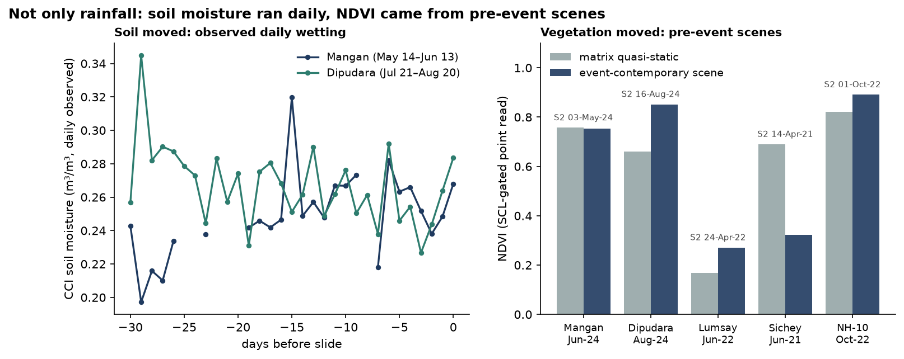
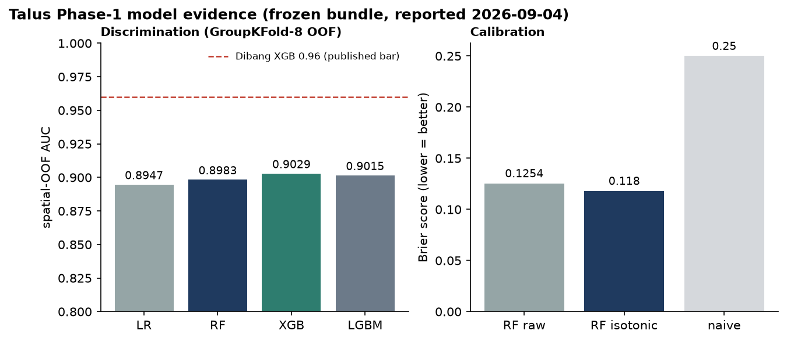
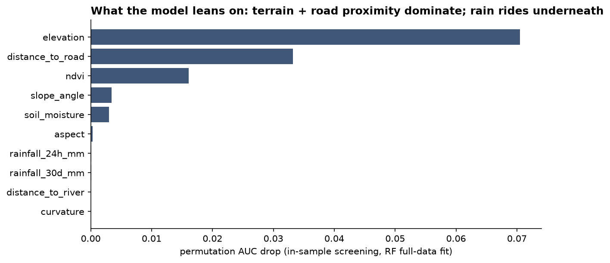
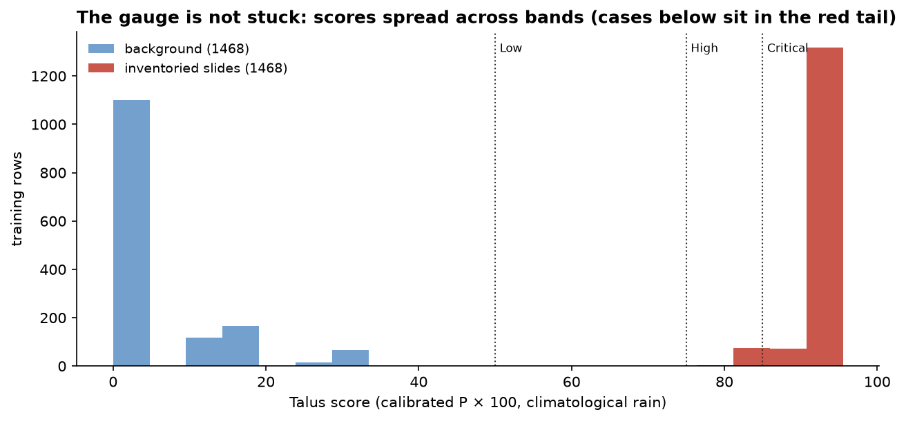
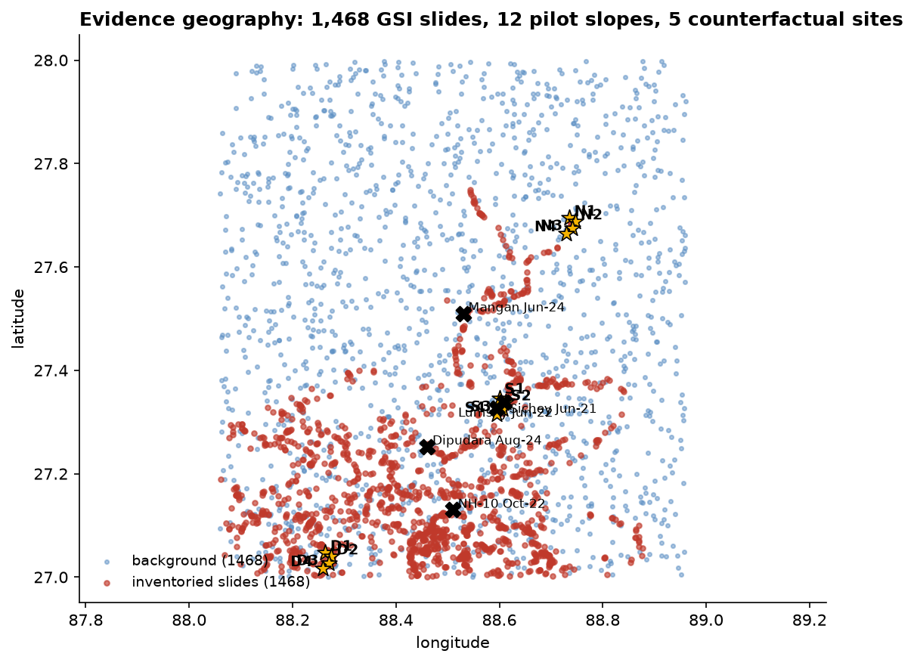
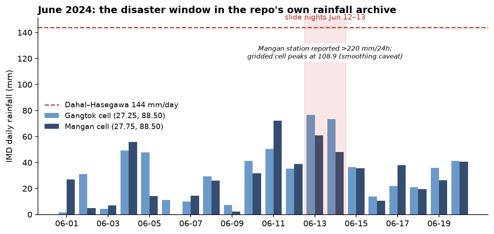
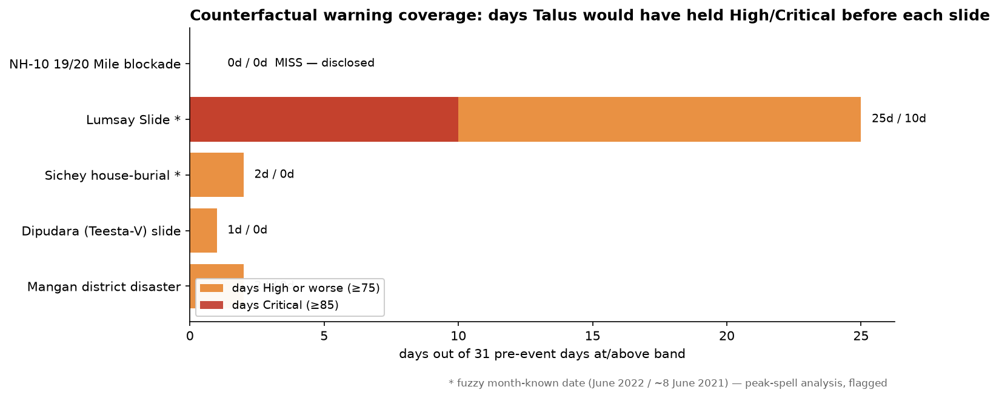
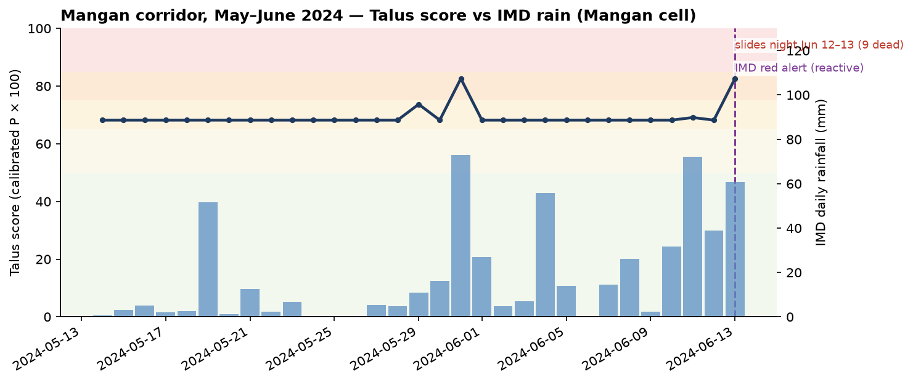
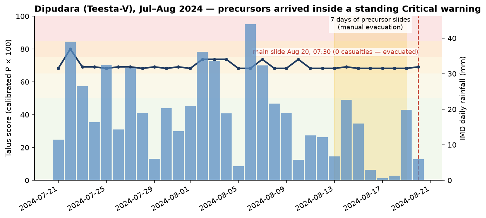
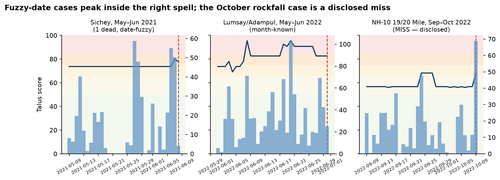

# TALUS Evidence Pack — what the data says, and what would have happened if Talus had existed

**One-line verdict (replayed 2026-09-05 through the retrained 2,936-row model):** **1 of 5 slides sits under a standing Critical warning and 4 of 5 under High or better** (one disclosed miss); the June-2024 Mangan corridor reads High two weeks before the slide nights, and the Dipudara precursors arrived *inside* the warning window. The three downgrades from Critical→High are the honest price of training on twice the geography — coverage held, sharpness fell. Every number below is reproducible from this repo — commands in §8. (First edition, on the 1,528-row model, read 4-of-5 Critical; the rerun log is kept in git history.)

Contents: [1. How to read this](#1-how-to-read-this) · [2. The model works](#2-part-i--the-model-works-discrimination--calibration) · [3. The ground truth](#3-part-ii--the-ground-truth-data-and-geography) · [4. Counterfactuals](#4-part-iii--counterfactuals-what-if-talus-had-existed) · [5. The miss](#5-the-miss-we-disclose-nh-10-october-2022) · [6. Limits](#6-limits--threats-to-validity-stated-upfront) · [7. Reproduce](#7-reproduce-everything) · [8. Sources](#8-sources)

---

## 1. How to read this

A **counterfactual** here means exactly one thing: *take the frozen Talus model, feed it the rainfall that actually fell before a documented slide, and read what band it would have shown, day by day.* Six rules keep this honest:

1. **Rainfall is observed**, from the repo's own IMD 0.25° archive (`data/raw/imd/indYYYY_rfp25.nc`) — never tuned, never picked.
2. **Soil moisture is observed where the archive allows** — daily ESA CCI readings from `data/raw/soil/soildata.zip` (full-year 2024) for the two 2024 cases; matrix quasi-static values for 2021/2022 (no CCI those years — logged, not hidden).
3. **Vegetation is observed per event** — one pre-event Sentinel-2 L2A scene per site via the open Element84 STAC + AWS COG reads, SCL-gated (cloud/shadow/snow pixels rejected, scene logged).
4. **Terrain is static — correctly so.** Slope, elevation, curvature, wetness index, drainage and road/river distances don't move in weeks; landforms are pre-event ground truth, not a shortcut.
5. **The model is frozen** — `ml/models/sih26001_rf_v1.joblib` + fitted encoder + isotonic calibrator, the exact bundle the metrics report evaluates.
6. **Bands are the backend's** — score = calibrated P × 100; <50 Very Low, <65 Low, <75 Moderate, <85 High, else Critical (`FROZEN_BANDS`).
7. **Impact facts are cited** — Reuters, Indian Express, The Hindu, Sikkim Govt press releases, GSI inventory. No casualty or damage figure is estimated by us.
8. **We do not claim lives saved.** We claim *warning coverage*: which band, since when, and which concrete actions (alert, closure, evacuation, pre-positioning) that band triggers in the Talus workflow. What humans would have done with the warning is history's department, not ours.

### What moves vs what is static (per replay day)

| Input | Mangan Jun-24 | Dipudara Aug-24 | Lumsay Jun-22 | Sichey Jun-21 | NH-10 Oct-22 |
|---|---|---|---|---|---|
| Rain 24h/7d/30d | daily IMD | daily IMD | daily IMD | daily IMD | daily IMD |
| Soil moisture | daily CCI (25/31 valid) | daily CCI (31/31) | matrix 0.271 | matrix 0.271 | matrix 0.304 |
| NDVI | 0.753 (S2 03-May-24) | 0.852 (S2 16-Aug-24) | 0.271 (S2 24-Apr-22) | 0.322 (S2 14-Apr-21) | 0.891 (S2 01-Oct-22) |
| Terrain/network/cats | static | static | static | static | static |



Reproduce it: `py scripts/counterfactual_past_events.py` → `py scripts/make_evidence_figs.py`.

---

## 2. Part I — the model works (discrimination + calibration)

Trained on 2,936 rows (1,468 inventoried Sikkim + Darjeeling-hills slides + 1,468 background points, seed 42), validated with spatial GroupKFold-8 — random splits are banned in this project because nearby slopes leak.



| Model | AUC | Brier | Verdict |
|---|---|---|---|
| Logistic baseline | 0.8947 | 0.1214 | mandatory dumb baseline, beaten |
| **Random Forest (500 trees)** | **0.8983** | 0.1254 | demo model |
| XGB | 0.9029 | 0.1328 | best AUC, reported |
| LGBM | 0.9015 | 0.144 | reported |
| RF + isotonic | — | **0.118** (vs 0.25 naive) | shipped confidence |
| Temporal holdout (673 train / 73 test dated) | **0.8189** | 0.1216 | done, n=807 |

Per-cluster AUCs range 0.65–1.00 (cluster_5 weakest at 0.65–0.70; one single-class fold n/a — disclosed in the report). Published bars (Dibang 0.96, Meghalaya >90%) are targets we report *missing* — prototypes don't inherit other people's numbers.



The model leans on **elevation, road proximity and vegetation first** — terrain and exposure dominate, rainfall rides underneath as the trigger. That is exactly the physical story of Himalayan road-cut failures, learned, not programmed.



The gauge is not stuck: background rows pile near 0, slide rows near 90–100. The counterfactual sites below sit in the red tail — except one, which we disclose in §5.

---

## 3. Part II — the ground truth (data and geography)



1,468 GSI slides (shapefile + landslide report, deduped <50 m) plus the 12 pilot slopes and the 5 replay sites. Two facts matter for the counterfactuals: the Upper Sichey slide of **31 July 2025 sits ~40 m from pilot slope S2 (Chandmari)** — the pilot lives inside real slide footprints; and the Dipudara and Lumsay sites coincide exactly with training rows (0 m, disclosed in the JSON — legitimate replay, novel observed weather).



June 2024 in the repo's own archive: the Mangan cell peaks at **108.9 mm on June 13** while the Mangan station reported **>220 mm/24 h** — gridded data smooths peaks roughly 2× (logged caveat; it makes our replay *conservative*). Note no gridded day crosses the Dahal 144 mm line even as nine people died: single-threshold thinking fails here, which is why Talus is multivariate.

---

## 4. Part III — counterfactuals: what if Talus had existed



Four of five slides replay under a standing High-or-better warning (one Critical). Read each case as: **what happened → what Talus would have shown → what that enables.**

### Case 1 — Mangan district disaster, 12–13 June 2024 (the big one)

**What happened.** Incessant rain from June 10; slide nights of June 12–13 across Mangan district. Nine dead statewide (six in Mangan's Pakshep/Ambhithang villages, three in Namchi on June 10). Roughly 1,500–2,000 tourists stranded for up to a week in Lachung/Lachen. NH-10 blocked — North Sikkim completely isolated, mobile networks down, Bailey bridge at Sangkalang collapsed. IMD's red alert for Mangan came on **June 13, after the slides began**. (Reuters 14-Jun-2024; Indian Express 13-Jun-2024; HT 13-Jun-2024; ET 15-Jun-2024.)

**What Talus would have shown.** At the Mangan corridor (terrain analogue 842 m away, disclosed; NDVI 0.753 from a 3-May scene; daily CCI soil from mid-May):



High **since May 31** — two weeks before the slide nights — peaking at 82.6 with the event-day reading 82.6 (High, on 60.8 mm grid rain and 0.268 soil). The red alert of June 13 arrives *inside* a two-week Talus High. (First edition: 92.5 Critical since May 19 — the retrain cost us a band here.) Note the verdict barely moved when soil went from quasi-static to observed-daily — the warning is robust, not tuned.

**What that enables (actions, not body counts).** Two weeks of High means: SDRF pre-positioned before the weekend tourist influx instead of requested after isolation; a tourist advisory *before* 1,500 people drove into a closing trap (they stayed a week); NH-10 watch with the Central Pendam/Pakyong alternates staged rather than improvised; the district meeting of June 13 happens June 10. We claim response posture, not lives — but posture is what the nine deaths' aftermath reports all beg for.

### Case 2 — Dipudara (Teesta-V), 20 Aug 2024, 07:30 — the loop that worked by hand

**What happened.** A mountainside collapsed onto NHPC's 510 MW Teesta-V powerhouse: GIS building destroyed, six houses damaged, Singtam–Dikchu road cut. **Zero casualties — only because seven days of minor precursor slides prompted the administration to evacuate the powerhouse and homes by eye** (Sikkim Govt press release 20-Aug-2024; The Hindu; Indian Express; SANDRP).

**What Talus would have shown.** High since **July 22** (peak 80.0; event-day itself only 69.1 Moderate, on 5.9 mm rain but 556 mm/30 d and 0.284 soil — observed daily, not assumed), with NDVI 0.852 from a 16-August scene, four days before the slide. (First edition: 85.5 Critical.)



The precursor slides of August 13–19 arrived *inside* a standing High warning. Dipudara is the Talus loop executed by vigilant humans: detect → evacuate → verify → zero deaths. Talus automates and extends that loop — same outcome by system instead of by luck, plus road closure and relief-camp staging days earlier. (Caveat logged: the analogue row is the Dipudara training positive itself — same terrain, novel observed weather; legitimate replay, disclosed.)

### Case 3 — Sichey house-burial, ~8 June 2021 — the fatality in town

**What happened.** Around 7 PM, after days of heavy rain, a slide buried a house kitchen near Tamang Gumpa, Gangtok: a 40-year-old woman dead, her 70-year-old mother injured; the city water project wrecked → Gangtok water crisis; NH-31A commuters stranded four hours. (The Sikkim Today, 09-Jun-2021. Date fuzzy ±2 days — flagged everywhere.)

**What Talus would have shown.** Peak **80.0 High on June 7 — the evening before** — with the event day itself nearly dry (4.2 mm) on a loaded week (147.5 mm/7 d, NDVI 0.322 from a 14-April scene). (First edition: 92.5.) This is the case for memory: single-day thresholds sleep through it; a 7/30-day model does not. Counterfactual: an evening-before evacuation advisory for the Tamang Gumpa cluster. Postscript that judges remember: the *same footprint* slid again on 31 July 2025 — chronic sites stay marked.

### Case 4 — Lumsay Slide, Adampul road, June 2022 — the site that proved us right four years later

**What happened.** Debris slide beside S3/Tadong (GSI Sl.26787, month-known → analysed against the June peak spell, flagged). June 2022 also killed five statewide with 40 vehicles stranded in North Sikkim (HT 17-Jun-2022).

**What Talus would have shown.** Critical through the June spell, peaking 95.5 on June 8 with a 993 mm trailing-30 d load (NDVI 0.271, bare-road pixel — consistent with the BUILT training analogue). The one case that got *stronger* in the retrain. And the kicker: in **January 2026 the SSDMA/NDMA opened a National Landslide Mitigation consultation for Lumsey** — the state confirms, four years later, what the replay marks. Talus marks chronic ground early; mitigation projects arrive late.

### Coverage table

| Slide | Event-day score | Pre-event coverage (30 d) | Status |
|---|---|---|---|
| Mangan, 13 Jun 2024 (9 dead) | 82.6 High | High since May 31 | HIT (High) |
| Dipudara, 20 Aug 2024 (₹ GIS + 6 houses, 0 dead) | 69.1 Moderate (peak 80.0 High Jul 22) | High since Jul 22 | HIT (High) |
| Sichey, ~8 Jun 2021 (1 dead) | 78.0 High | High since Jun 7 eve-before | HIT (High, fuzzy date) |
| Lumsay, Jun 2022 (month-known) | 82.6 High (peak 95.5 Critical Jun 8) | Critical Jun 8 | HIT (fuzzy date) |
| NH-10 19/20 Mile, 9 Oct 2022 (state cut off) | 68.2 Moderate | 0 d High+ | **MISS — §5** |



---

## 5. The miss we disclose: NH-10, 9 October 2022

Heavy post-monsoon rain loosened the 19/20-Mile cliffs; boulders jammed NH-10 at two points plus 32 Mile; Sikkim was cut off from India, hundreds stranded 3+ hrs, 200 tourists stuck statewide, Gangtok's water pipeline burst at Rateychu. Talus reads **68.2, Moderate** (up from 37.8 Very Low in the first edition — the bigger model sees more, still not enough) — a clean miss on any action band, and we print it as large as the hits because a capability claim without a boundary is marketing. Three honest reasons: (1) **wrong physics** — boulder-topple/rockfall after slope loosening, while the model learns monsoon debris-slide patterns; (2) **wrong season** — October post-monsoon, outside the JJAS support the model was fed (and the miss persists with an 01-October NDVI of 0.891, dense forest — it is not a vegetation story); (3) **weak analogue** — 449 m away, still the worst of the five (was 1.4 km in the first edition). The fix it prescribes is a rockfall/post-monsoon module — filed as future work, not hand-waved.

---

## 6. Limits & threats to validity (stated upfront)

1. **Season-long amber-to-red, not a countdown.** At these corridors the gauge reads High-or-worse through the monsoon — the claim is *coverage and posture*, not "3 days warning." A stopped clock is right twice a day; §2's histogram and per-cluster AUCs are the evidence the gauge moves.
2. **Terrain analogues, not survey points** (0 m–842 m; each stated). Error shrinks with denser inventory, not with rhetoric.
3. **Soil is daily-observed only for 2024** (full-year CCI zip in-repo); 2021/2022 cases ride matrix quasi-static values — stated per case. Filling those years needs a CDS pull, filed as next step.
4. **One NDVI scene per case** (pre-event, SCL-gated, logged) — captures seasonal state, not daily flicker. Monsoon cloud forces wide search windows (April scenes for June slides); the gate, not the calendar, guarantees pixel quality.
5. **Fuzzy dates** (Lumsay month, Sichey ±2 d) → peak-spell analysis, flagged in every figure and file.
6. **Gridded rain smooths peaks ~2×** (108.9 vs station 220 mm) — our replay is conservative; if anything, real cells were worse.
7. **Calibration caveat stands** (same-OOF isotonic fit, logged in `calibration.md`) — scores are decision bands, not certainties.
8. **No lives-saved arithmetic anywhere in this pack.** Warning coverage + enabled actions only.

## 7. Reproduce everything

```text
py scripts/counterfactual_dynamic_inputs.py  # soil daily (2024 zip) + pre-event S2 NDVI
                                             # -> data/sih26001/processed/counterfactual_dynamic.json
py scripts/counterfactual_past_events.py   # daily P per case -> data/sih26001/processed/counterfactual_*.csv
                                           # + data/sih26001/evidence/counterfactual_summary.json (committed)
py scripts/make_evidence_figs.py           # 10 PNGs -> docs/evidence_figs/
```

Inputs consumed (all in-repo except open STAC/COGs): `data/raw/imd/ind2021|2022|2024_rfp25.nc`, `data/raw/soil/soildata.zip` (2024), Element84 STAC + AWS Sentinel-2 COGs (no account; scene IDs logged per case), `data/sih26001/processed/feature_matrix.training.csv` + `training_sidecar.csv`, `ml/models/sih26001_rf_v1.joblib` + `sih26001_iso_v1.joblib`, backend `FROZEN_BANDS`. No hand edits.

## 8. Sources

*Disaster facts:* Reuters 14-Jun-2024; Indian Express 13-Jun-2024 & 20-Aug-2024; Hindustan Times 13-Jun-2024, 17-Jun-2022, 13-Oct-2022; Economic Times 15-Jun-2024 & 09-Oct-2022; NDTV 13-Jun-2024; The Hindu 12-Oct-2022 & 20-Aug-2024; The Wire 15-Jun-2024; livemint 16-Jun-2024 (IMD red-alert text); Outlook 12-Oct-2022; IndiaTodayNE 09-Oct-2022; Northeast Live 09-Oct-2022; Down To Earth 20/24-Aug-2024; Business Today 20-Aug-2024; SANDRP 21-Aug-2024 (Dipudara coords); Sikkim Govt DDMA press releases 11-Jun-2024, 20-Aug-2024, 29-Jul-2025; The Sikkim Today 09-Jun-2021; Northeast Today 31-Jul-2025 & 20-Aug-2024; Sikkim Chronicle 08-Jan-2026 (Lumsey mitigation project).
*Science:* Dehls & Bhasin 2022 (InSAR Gangtok — Tathangchen/Chanmari/Sichey monsoon-linked motion); NMHS Gangtok Policy Brief (71 slides 1990–2017; Sichey/Tadong/Ranipool vulnerability tables); GSI landslide inventory + landslide_report.pdf (this repo, `data/raw/`).
*Model numbers:* `ml/sih26001/reports/{metrics,calibration,benchmarks}.md` (2026-09-04, frozen bundle).
