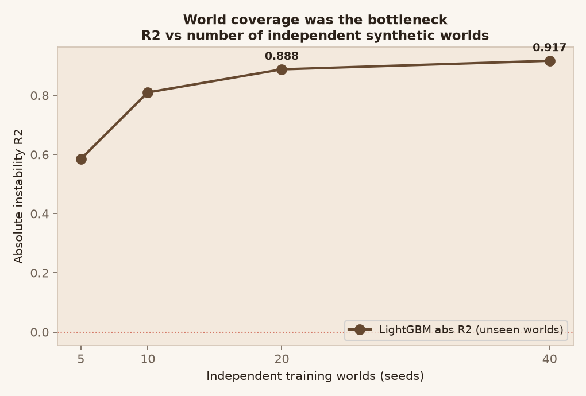
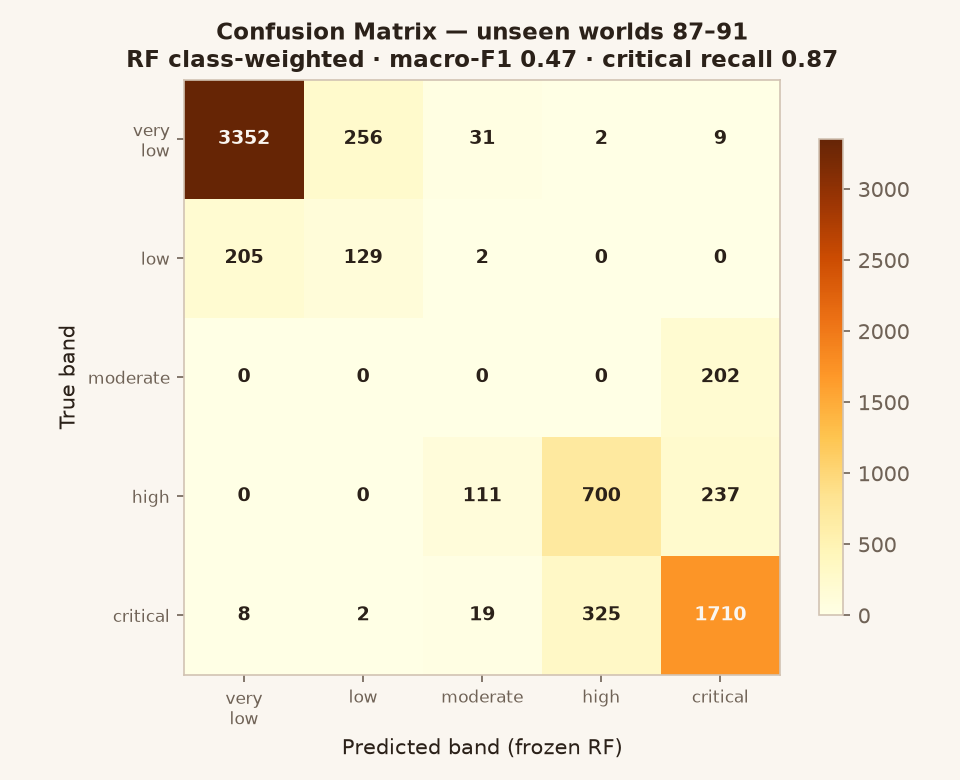
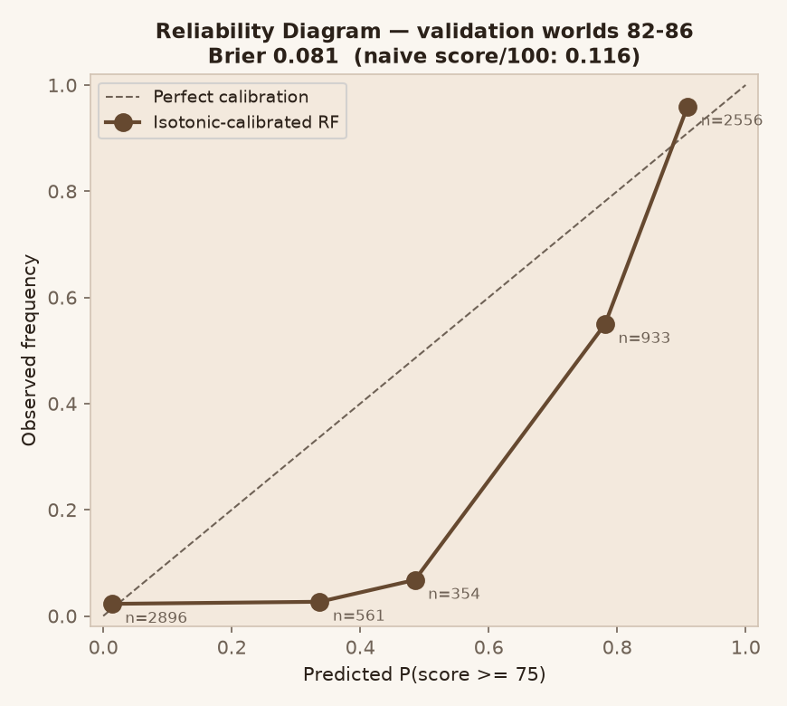
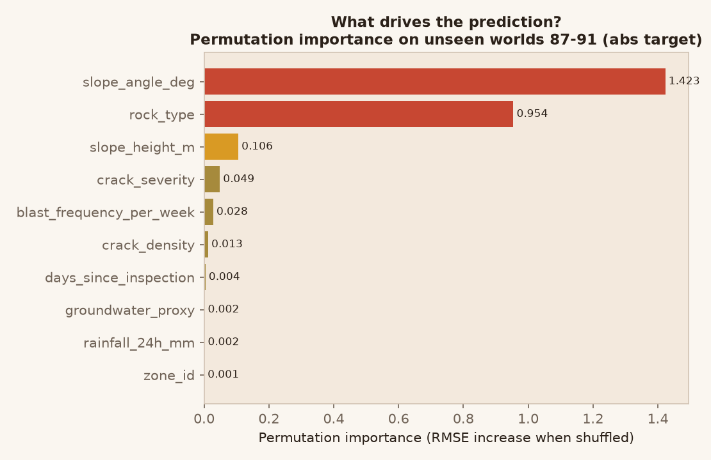
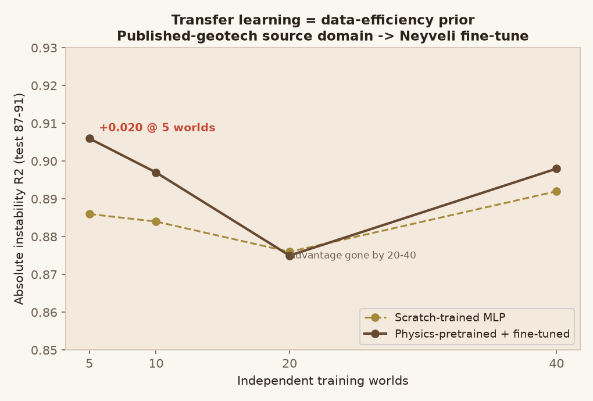
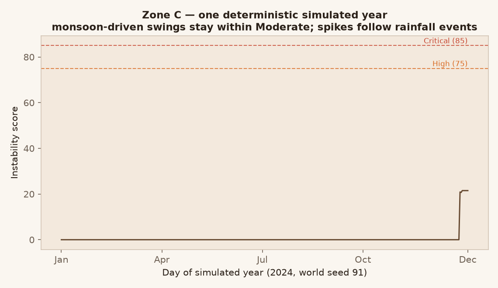
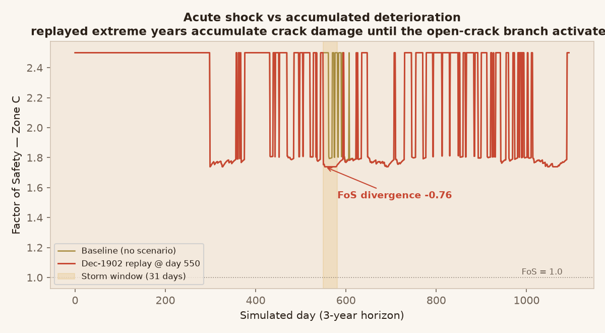

# TALUS — Evidence & Backup Slides

**Companion to the main deck.** Every chart below is generated from committed
artifacts (frozen model, calibration, corpus) — regenerate anytime via the
scripts noted in each section. Use these when a panel member asks to "see the
data" or "prove it." Each exhibit ends with the one sentence to say out loud.

---

## Exhibit 1 — The leakage demonstration

**What it shows:** with a naive random split the model "achieves" R² ≈ 0.998 —
and fails honestly (R² = −0.53) the moment an entire synthetic world is held
out. As world coverage grows (5 → 40), honest R² climbs to 0.92.

**Say:** *"We caught our own leakage before a judge could. Random row splitting
is invalid for correlated mine data — all results use seed-intact splits, and
test worlds were touched exactly once."*

---

## Exhibit 2 — Confusion matrix (classification)

**What it shows:** RF classifier on unseen worlds 87–91. Very-low and critical
bands are strong; the narrow `moderate` band is the known weak spot.

**Say:** *"Critical recall is 0.87 — missing a dangerous zone is the costly
error, so we optimized for it. The moderate band's weakness is why we ship
regression-then-threshold as the production path rather than raw multiclass."*

---

## Exhibit 3 — Calibration (FR-03)

**What it shows:** predicted P(score ≥ 75) vs observed frequency on validation
worlds. Isotonic-calibrated RF: Brier **0.081** vs 0.116 naive; high-risk bins
track the diagonal (0.93 predicted → 0.98 observed).

**Say:** *"Confidence in TALUS is a calibrated probability of elevated risk
under our prototype target definition — measured, not decorative."* Never call
it "probability of rockfall"; no incident labels exist.

---

## Exhibit 4 — Feature importance (explainability)

**What it shows:** permutation importance on unseen worlds. Slope geometry and
rock type dominate; groundwater contributes; inspection cadence ≈ 0 (no
scheduler crutch).

**Say:** *"The model's drivers match the physics chain we built — this is SHAP
and permutation importance agreeing with engineering intuition."*
Caveat if pushed: crack/blast effects are confounded and lagged (audit §SS23.4).

---

## Exhibit 5 — Transfer learning

**What it shows:** a surrogate pretrained on 120K published-geotech physics
cases beats scratch training when target worlds are scarce (+0.02 at 5 worlds)
and converges by 20–40. Zero-shot alone scores −0.97 — the prior helps, it does
not replace data.

**Say:** *"Physics knowledge acts as a data-efficiency prior: better predictions
exactly where real mines would have the least data."*

---

## Exhibit 6 — One simulated year (Zone C)

**What it shows:** the deterministic daily instability series for one zone-world
(seed 91). Dry-season stability, monsoon-driven swings — thresholds at 75/85.

**Say:** *"Every zone has a full reproducible year like this; the corpus is 50
such worlds, 73,000 days, one command to regenerate."*

---

## Exhibit 7 — Scenario Engine: acute shock vs accumulated damage

**What it shows:** replaying the real Dec-1902 storm (1,088 mm/month, IMD
provenance) on a 3-year horizon. A single storm barely moves FoS — but repeated
extreme wetting accumulates crack damage until the open-crack strength branch
activates: **FoS diverges −0.76 from baseline across 51 days.**

**Say:** *"Acute rainfall is not the same as accumulated deterioration. TALUS
distinguishes them — that distinction is what makes a what-if tool honest."*

---

## Quick-reference numbers (memorize)

| Claim | Number | Source |
|---|---|---|
| Honest unseen-world regression | R² 0.90–0.92, MAE ~8.5 | benchmark protocol |
| Leakage proof | random 0.998 vs holdout −0.53 | SS23.1 |
| Coverage curve | −0.58 → 0.59 → 0.92 (5→20→50 worlds) | SS23.2/D |
| Model agreement | 7 families within ±0.02 | SS23.3 |
| Calibration | Brier 0.081 vs 0.116; ECE 0.095 vs 0.157 | SS25 |
| Critical recall | 0.87 (RF, class-weighted) | Exhibit 2 |
| Transfer advantage | +0.02 at 5 worlds; parity at 20–40 | SS23.6 |
| Scenario divergence | −0.76 FoS / 51 days / branch fired | SS19 |
| Backend tests | 25/25 | CI-able |

## Regeneration

Charts: scratch `gen_evidence.py` (uses frozen model + corpus + engine).
Numbers: `docs/observations.md` SS17–SS25. Raw metrics: `ml/benchmark/results/`,
`ml/experiments/results/`.

## Claims policy (read before improvising)

Synthetic-only evidence · confidence = calibrated P(elevated synthetic risk),
not rockfall probability · bands are prototype thresholds · SHAP explains the
model, not the slope · final decisions remain with qualified personnel.
